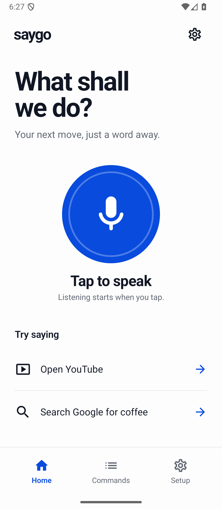
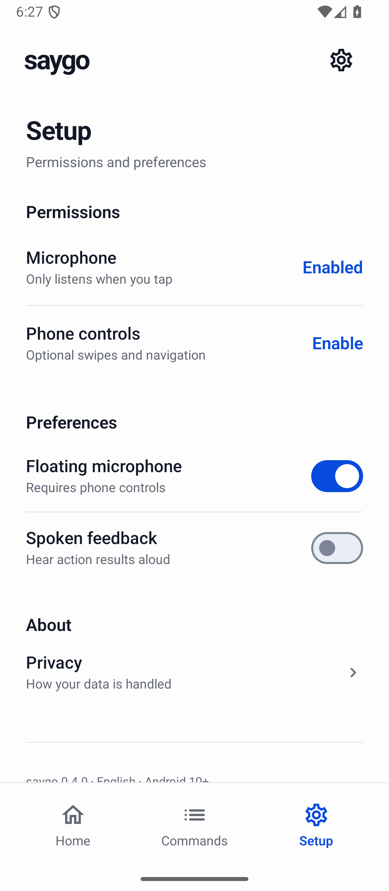

# saygo

**Current version: 0.8.0.** Adds explicit hold-and-drag between numbered grid cells and cancellation of queued input. **80 local tests passed** (59 Android/API36 + 21 JVM), with build, lint and release checks passing. GitHub also passed 56 core tests on each of Android 10, 14 and 16. See [drag commands and verification](docs/DRAG_0.8.0.md).

Additional [speech-provider and real-app audit](docs/SPEECH_APP_AUDIT_0.8.0.md): four synthetic-audio recognition probes passed, and YouTube displayed the recognized search query and video results. Google returned a traffic challenge; live microphone recognition and Instagram remain unverified.

[YouTube Shorts control audit](docs/YOUTUBE_CONTROL_0.8.0.md): explicit grid, tap and swipe commands opened a Short, paused/resumed playback, advanced to another clip and returned. These checks bypass speech input.

**Previous version: 0.7.0.** Adds native two-finger zoom. **74 local tests passed** (54 Android/API36 + 20 JVM), with build, lint and release checks passing. GitHub also passed 51 core tests on each of Android 10, 14 and 16. See [pinch commands and verification](docs/PINCH_0.7.0.md).

**Previous version: 0.6.0.** Adds a numbered grid for unlabelled controls. **69 local tests passed** (50 Android/API36 + 19 JVM), with debug/release builds and lint passing. GitHub also passed 47 core tests on each of Android 10, 14 and 16. See [grid controls and verification](docs/GRID_0.6.0.md).

Previous version **0.5.0**: Adds direct taps, long presses and text editing. **59 tests passed** locally (43 Android/API36 + 16 JVM), with debug/release builds and lint passing. GitHub also passed 40 core tests on each of Android 10, 14 and 16. See [new controls and verification](docs/DIRECT_CONTROLS_0.5.0.md) and the [original capability audit](docs/CAPABILITY_AUDIT.md). This is not unrestricted phone control. Version 0.4.2 fixed all three rescan defects; its hosted build and API 29/34/36 core tests passed after correcting SDK setup. See [previous fixes](docs/FIXES_0.4.2.md).

A minimal Android voice-command app, written in Kotlin and Jetpack Compose.

saygo opens installed apps, searches Google and YouTube, and optionally performs one tap, long press, text edit, swipe, drag, pinch-zoom or system navigation action per spoken command. English only. Android 10+ (`minSdk 29`), targeting Android 16 (`targetSdk 36`).

Version 0.4.0 implements the selected cobalt-and-white design: a bold two-line headline, circular microphone, concise command rows, and bottom navigation. Commands, Setup, the listening sheet, launcher accent, and floating microphone share the same visual system. Dark mode and enlarged system text are supported.

 

Version 0.4.1 fixes microphone-denial recovery, consent checks for queued actions, and spoken-feedback cancellation. All 32 Android instrumentation tests and 13 unit tests pass on the checked emulator. See [the functional audit](docs/FUNCTIONAL_AUDIT.md) for every button, test evidence, and explicit limits.

## Try it

1. Install the supplied debug APK on a test phone, or build one below.
2. Open **saygo → Setup → Microphone → Enable**. Review the speech disclosure and allow microphone access.
3. Tap the microphone and say **“Open YouTube”** or **“Search Google for coffee nearby”**.
4. For scrolling and navigation, choose **Setup → Phone controls → Enable**, review the separate accessibility disclosure, then enable **saygo phone controls** in Android accessibility settings.
5. Open Instagram and navigate to Reels yourself. Tap the floating saygo button and say **“Next reel”**. It sends one upward swipe to that same app.
6. Drag the floating button to move it. Hide it or disable controls from Setup.

Android may restrict accessibility settings for apps installed outside a trusted store. If the OS blocks this setting, follow the device's app information guidance for your own trusted test APK. saygo never changes this protection automatically.

## Commands

| Phrase | Action |
|---|---|
| `Open Instagram`, `Launch YouTube Music` | Launch an installed app by its full label |
| `Search Google for <query>` | Open a Google web search |
| `Search YouTube for <query>` | Open YouTube search in a handler app or browser |
| `Show grid`, `Zoom cell 5`, `Grid back`, `Hide grid` | Display and refine a 3×3 coordinate guide; up to two zooms |
| `Tap cell 5`, `Long press cell 5` | One touch at that cell’s centre; English number words also work |
| `Drag cell 1 to cell 9` | Hold, move and release between two different cells of the current grid |
| `Tap Search`, `Long press Download` | Act on one visible control with that exact, unique label |
| `Type <text>` | Insert literal text at the cursor, replacing selected text, in the focused field |
| `Replace text with <text>`, `Clear text`, `Select all` | Edit the focused text field |
| `Next reel`, `Next video`, `Scroll down`, `Swipe up` | One upward swipe |
| `Previous reel`, `Previous video`, `Scroll up`, `Swipe down` | One downward swipe |
| `Zoom in`, `Zoom out` | One two-finger gesture centred on the current app window; the target content must support pinch zoom |
| `Swipe left`, `Swipe right` | One horizontal swipe |
| `Go back`, `Go home`, `Recent apps` | Android system navigation |
| `Cancel`, `Stop`, `Never mind` | Cancel listening and queued input; input already sent cannot be undone |

The parser is case insensitive and tolerates extra spaces and sentence-ending punctuation. Unknown commands and chained instructions are rejected. Queries are URL encoded and never interpreted as additional actions.

Not implemented: always-on listening, a wake word, arbitrary multi-finger gestures, automatic Reels navigation, repeat scrolling, dedicated purchase/messaging workflows, or autonomous planning. Named controls must expose a unique usable accessibility label. For an unlabelled control, say “Show grid”, narrow its area with “Zoom cell <number>”, then say “Tap cell <number>”. The grid closes after a touch, app/window change, scroll, rotation, screen-off, cancellation, or one minute without another grid command. Coordinate taps and drags do not identify what a button does; choose the area yourself. Both drag endpoints use the current grid region. A drag holds first and then moves in a straight line; the receiving app must support that gesture. Cancellation during the hold releases at the source, which may already have reacted to the hold. Movement already sent may finish. Focus a text field before dictation; password fields require the keyboard. The app never presses Send automatically after typing. saygo does not promise to control every Android screen. It cannot bypass a locked phone or Android security controls.

## Build

Use Android Studio with JDK 17 or newer, Android SDK platform 36, and build-tools 35.0.0. Tested here with JDK 21. The wrapper pins Gradle 8.14.5; AGP is 8.13.2 and Kotlin is 2.3.21. Compose uses the pinned 2026.01.00 stable BOM rather than following the newest release automatically.

```sh
# Windows: use .\gradlew.bat instead of ./gradlew
./gradlew testDebugUnitTest lintDebug assembleDebug
./gradlew connectedDebugAndroidTest    # with an emulator/test device connected
./gradlew bundleRelease                # unsigned bundle; signing is separate
```

Set `ANDROID_HOME` to your SDK or create an ignored `local.properties` with `sdk.dir=...`. No API keys or backend are needed. The first online build downloads dependencies. GitHub Actions builds, tests, lints, and retains the debug APK and reports; it does not publish automatically.

## Design and architecture

- `ui/`: responsive Compose screens, light/dark themes, scalable text, labelled controls, command guide, and prominent permission disclosures.
- `speech/SpeechSession`: a single, bounded recognition session. On-device recognition is preferred when Android reports support. Otherwise the system provider is used after disclosure. No automatic retry loop.
- `commands/CommandParser`: pure, deterministic grammar with unit tests. No LLM, remote planner, fuzzy action selection, or hidden multi-step actions.
- `commands/CommandExecutor`: app intents, encoded search URLs, and explicit delegation to phone controls.
- `control/PhoneControlService`, `NodeActions`, `GridOverlay` and `GridRegion`: opt-in accessibility overlay, target validation, named control actions, focused-field text editing, gestures and navigation. Control labels and field contents are processed locally only when a command needs them. Stops pending work when interrupted or disabled.
- `VoiceActivity`: visible microphone session over the current app. Closing or backgrounding it cancels recording. The service waits for the voice panel to leave before acting.
- `data/`: consent/preferences stored locally; only the most recent result is held in memory. No raw audio, transcript, screenshot, or command-history persistence.

Upgrading from 0.4.x requires accepting the expanded phone-control disclosure again before controls can reconnect.

The floating button uses an accessibility overlay, not the general “draw over other apps” permission. Speech happens in a visible activity; there is no always-running microphone service. Google Play review is still required for AccessibilityService usage. Read [publishing](docs/PUBLISHING.md), [privacy draft](docs/PRIVACY.md), and [device test plan](docs/TESTING.md).

## Contributing

Keep each voice command narrow, documented, and covered by parser/executor tests. Do not silently broaden matching or add automatic action chaining. Run the build, unit tests, and lint before opening a PR. Test accessibility changes on real devices as well as the emulator. Never commit signing keys, `local.properties`, recordings, or user transcripts.

## License

MIT. The saygo name is a working name, not a trademark clearance statement.


