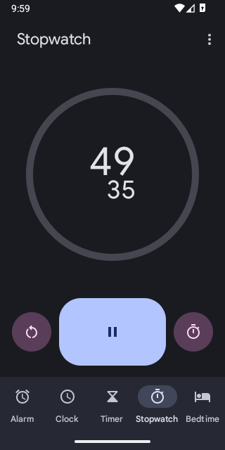
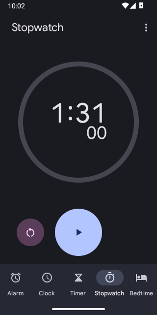

# Real Clock app verification: saygo 0.9.2

On the owned Android 16 emulator, individual Saygo commands opened Google Clock 7.5 (563137996), selected Stopwatch, started it, paused it and reset it.

| Literal command | Observed native result |
|---|---|
| `Open Clock` | Google Clock opened. |
| `Tap Stopwatch` | Stopwatch tab displayed zero and Start. |
| `Tap Start` | Timer advanced; the screenshot shows 49.35 and the Pause icon. |
| `Tap Pause` | Control changed to Play; separate later captures both show 1:31.00. |
| `Tap Reset` | Native timer fields returned to 00.00 and Start. |
| `Tap Clock` | Original Clock tab restored. |

[Probe logs, sanitized timer fields and observations](clock-evidence/). The running and paused Clock UI continuously updates/blinks, so UIAutomator's idle-wait dump timed out in those states. Screenshots were used for those observations; the reset state also has parsed native UI fields.

This uses the opt-in test-only ExplicitCommandProbe. It feeds the listed literal commands to the production parser/executor/service, with a human-selected next command after inspecting each state. It does not demonstrate microphone capture, speech recognition, autonomous planning, alarm/timer workflows or every Clock version. The stopwatch was reset; no alarms were created or changed. Test consent/accessibility settings were restored by the probe.
