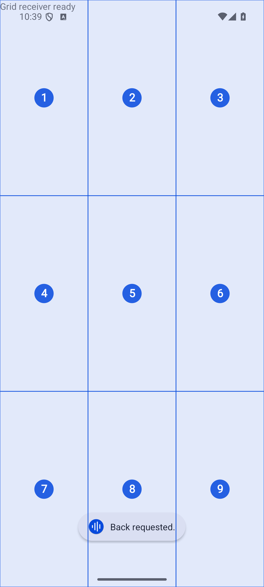
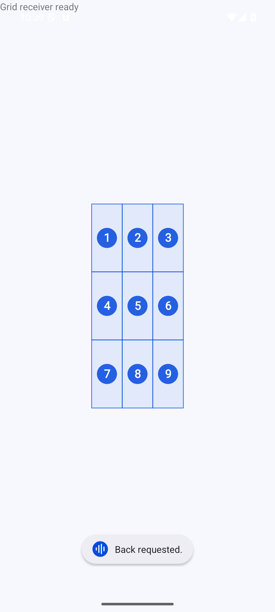

# saygo 0.6.0: numbered grid

The next gap in individual voice control was an unlabelled control or canvas that exposes no usable accessibility label. Version 0.6.0 adds a touch-transparent 3×3 grid over the current app. It uses native AccessibilityService gestures and does not take screenshots or use a remote planner.

## Commands

1. Open the target app and use the floating microphone to say **Show grid**.
2. Say **Zoom cell 5** to divide that cell into nine smaller areas. Up to two zooms are available; **Grid back** undoes a zoom.
3. Say **Tap cell 5** or **Long press cell 5** to touch that cell's centre. The grid closes after the touch.
4. **Hide grid** or **Cancel** dismisses it without a touch. English number words such as **five** also work. **Tap 5** continues to mean a named control labelled “5”; coordinate commands explicitly include “cell”.

Cells run 1–9 from left to right, top to bottom. The guide hides while the voice panel is open and returns when it closes. It expires after one minute without a grid command. It also clears on app/window changes, scrolling, rotation, screen-off, returning to saygo, disabling controls or interrupting the service. A coordinate command never decides which control to use; the user chooses a position.

## Implementation and verified behavior

The grid retains only the originating package, window ID, bounds and selected region in memory. It validates that target before dispatch. Both overlays are hidden before the touch and the target is checked again after Android's input-window transition. Completion or cancellation restores the microphone at its previous position. Cancelling during that transition must not leave the microphone detached.

Window notifications can describe old state or omit a new Activity transition when returning to an existing window. Window-state and window-set changes therefore trigger a debounced check of Android's actual active root. Old scroll events are ignored. Locked or non-interactive displays reject input. Existing v2 disclosure covers the same direct gestures and local screen data; the UI, accessibility description, privacy draft and publishing draft now describe the optional grid.

**49 Android instrumentation tests and 19 JVM tests passed (68 total) on the final local candidate.** The full Android run used API36 and included actual YouTube/Chrome routing. Debug build, lint and release shrinking/bundle tasks passed. Lint: 0 errors, 10 existing advisory warnings. The APK is version 0.6.0/code 13 with minSdk29/targetSdk36; signature and 16 KB alignment checks passed.

Six new Android tests check actual touches at the four corner-cell centres and the centre in a separate unlabelled canvas, with the microphone placed at the tap point; zoom/back and native long-press delivery; hiding/restoring the guide around voice input; cancellation during overlay detachment; changed apps/windows; stale events; revoked consent; real screen-off/wake; rotation; actual one-minute expiry; and service shutdown. The command-guide test scrolls through the new examples. New JVM coverage checks spoken cell syntax and partition geometry, including odd-sized, offset windows.

The non-interactive guide does not appear in UiAutomation's interactive-window list. Tests inspect its actual attached View and screen position, independently assert real touch delivery, and capture screenshots after rendering. Screenshot assertions require visible grid pixels; an attached View alone is not counted as a visual pass. During development, these checks exposed a pre-render capture, an app-switch invalidation defect, and an encoding error in a Windows helper; those were corrected before the final run.

Evidence: [full Android run](grid-evidence/grid-final-instrumentation.txt), [delivered coordinates](grid-evidence/grid-delivery.txt), [build and release checks](grid-evidence/grid-release-verification.log), plus JVM XML and screenshots in [grid-evidence](grid-evidence/).

 

## Remaining verification and product limits

Hosted API29/34/36 checks for this version are pending until the app commit is pushed. Previous hosted results describe 0.5.0 and are not substituted for this version. CI excludes three tests requiring actual YouTube/Chrome installation; those remain part of the local full suite.

This still does not prove “anything” on every phone. Dragging, multi-finger gestures, continuous listening/wake words and autonomous tasks are not implemented. Text editing still depends on usable fields. Live speech accuracy, actual Instagram Reels and OEM-specific behavior remain unverified under the user's emulator-only preference. Grid coordinates can become outdated when content moves within an unchanged window; the grid does not interpret that content. Google Play submission and approval remain outstanding. The APK is debug signed and the release bundle is unsigned.
